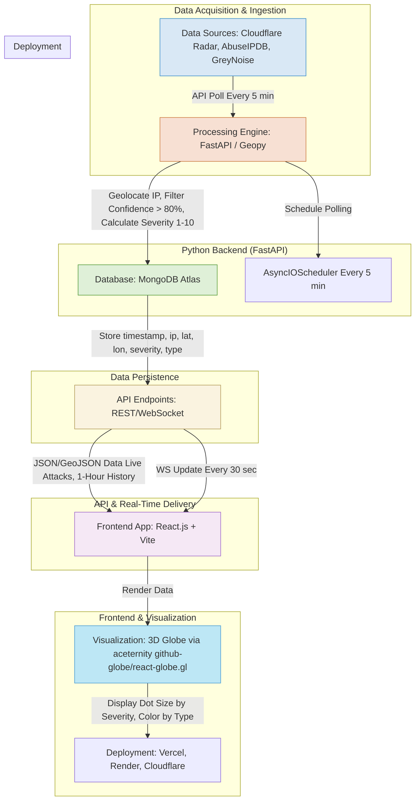

  
  # 🌍 DDoS Attack Globe - Complete Implementation Guide

## 📋 Table of Contents
1. [Architecture Overview](#architecture-overview)
2. [Backend Setup](#backend-setup)
3. [Frontend Development](#frontend-development)
4. [API Integration Guide](#api-integration-guide)
5. [Deployment](#deployment)
6. [Satellite Tracking (Optional)](#satellite-tracking-optional)
7. [Resources & References](#resources--references)

## Architecture Overview



## Backend Setup 

### Step 1: Environment Setup
```bash
# Create project directory
mkdir ddos-tracker-backend
cd ddos-tracker-backend

# Create virtual environment
python -m venv venv
source venv/bin/activate  # Windows: venv\Scripts\activate

# Install dependencies
pip install fastapi uvicorn pymongo requests geopy dnspython apscheduler python-multipart websockets
```

### Step 2: Project Structure
```
ddos-tracker-backend/
├── main.py
├── requirements.txt
├── .env
└── README.md
```

### Step 3: Core Backend Implementation
```python
# main.py - Key endpoints
@app.get("/api/attacks/live")
async def get_live_attacks():
    """Returns attacks from last hour with pagination"""
    attacks = list(attacks_collection.find({
        'timestamp': {'$gte': datetime.utcnow() - timedelta(hours=1)}
    }).sort('timestamp', -1).limit(1000))
    return {'attacks': attacks, 'count': len(attacks)}

@app.websocket("/ws/live")
async def websocket_endpoint(websocket: WebSocket):
    """Real-time WebSocket for live attack updates"""
    await websocket.accept()
    while True:
        data = await get_live_attacks()
        await websocket.send_json(data)
        await asyncio.sleep(5)  # Update every 5 seconds

@app.get("/api/stats")
async def get_stats():
    """Returns attack statistics and analytics"""
    return {
        'total_attacks': count,
        'attacks_by_type': breakdown,
        'top_targets': locations
    }
```

### Step 4: Data Collection Scheduler
```python
# Scheduled task to fetch data from APIs
scheduler = AsyncIOScheduler()
scheduler.add_job(fetch_attack_data, 'interval', minutes=5)
scheduler.start()

async def fetch_attack_data():
    # Cloudflare Radar API
    radar_data = await fetch_cloudflare_radar()
    
    # AbuseIPDB API  
    abuse_data = await fetch_abuseipdb()
    
    # GreyNoise API
    greynoise_data = await fetch_greynoise()
    
    # Process and store in MongoDB
    await process_and_store_attacks(radar_data + abuse_data + greynoise_data)
```

## Frontend Development 

### Step 1: Project Initialization
```bash
npx create-next-app@latest ddos-globe --typescript --tailwind --eslint --app
cd ddos-globe
npm install axios socket.io-client three @types/three lucide-react
```
Frontend globe[Aceternity Globe](https://ui.aceternity.com/components/github-globe)
Inspiration Website [kaspersky](https://cybermap.kaspersky.com/)
### Step 2: Core Components Structure
```
components/
├── ui/
│   ├── globe.tsx          # 3D Globe visualization
│   ├── status-panel.tsx   # Real-time stats
│   └── controls.tsx       # User controls
├── DDoSGlobe.tsx          # Main component
└── SatelliteView.tsx      # Optional satellite view
```

### Step 3: Main App Integration
```typescript
// app/page.tsx
export default function Home() {
  return (
    <div className="min-h-screen bg-black text-white">
      <Header />
      <DDoSGlobe />
      <StatusPanel />
      <Controls />
    </div>
  );
}
```

### Step 4: Real-time Data Handling
```typescript
// WebSocket connection manager
const useAttackData = () => {
  const [attacks, setAttacks] = useState<Attack[]>([]);
  const [isConnected, setIsConnected] = useState(false);

  useEffect(() => {
    const socket = io(backendUrl, { transports: ['websocket'] });
    
    socket.on('connect', () => setIsConnected(true));
    socket.on('disconnect', () => setIsConnected(false));
    socket.on('update', (data) => setAttacks(data.attacks));
    
    return () => socket.disconnect();
  }, []);

  return { attacks, isConnected };
};
```

## API Integration Guide

### 1. Cloudflare Radar API
**Usage**: Global attack trends and DDoS patterns
```python
async def fetch_cloudflare_radar():
    response = requests.get(
        'https://api.cloudflare.com/client/v4/radar/attacks/layer3/summary',
        headers={'Authorization': f'Bearer {CLOUDFLARE_API_KEY}'}
    )
    return process_cloudflare_data(response.json())
```

**Rate Limits**: 1,000 requests/day (free tier)
**Key Endpoint**: `/radar/attacks/layer3/summary`

### 2. AbuseIPDB API
**Usage**: IP reputation and attack reports
```python
async def fetch_abuseipdb():
    response = requests.post(
        'https://api.abuseipdb.com/api/v2/check',
        data={'ipAddress': ip, 'maxAgeInDays': 1},
        headers={'Key': ABUSEIPDB_API_KEY, 'Accept': 'application/json'}
    )
    return process_abuseipdb_data(response.json())
```

**Rate Limits**: 1,000 requests/day
**Confidence Threshold**: Filter results >80% confidence

### 3. GreyNoise API
**Usage**: Internet-wide scan and attack activity
```python
async def fetch_greynoise():
    response = requests.get(
        f'https://api.greynoise.io/v3/community/ip/{ip}',
        headers={'Key': GREYNOISE_API_KEY}
    )
    return process_greynoise_data(response.json())
```

**Rate Limits**: 2,000 requests/day (Community tier)

## Deployment

### Backend Deployment (Render.com)
1. **Push code to GitHub**
2. **Connect repository to Render**
3. **Set environment variables**:
   - `MONGODB_URI`
   - `CLOUDFLARE_API_KEY`
   - `ABUSEIPDB_API_KEY`
   - `GREYNOISE_API_KEY`

4. **Build Command**: `pip install -r requirements.txt`
5. **Start Command**: `uvicorn main:app --host 0.0.0.0 --port $PORT`

### Frontend Deployment (Vercel)
1. **Build optimized version**: `npm run build`
2. **Deploy to Vercel**: `vercel --prod`
3. **Configure environment**:
   - `NEXT_PUBLIC_BACKEND_URL`: Your Render backend URL

### Cloudflare Setup (Optional)
1. **Create Cloudflare account**
2. **Add domain** (or use subdomain)
3. **Configure DNS** to point to Vercel
4. **Enable DDoS protection** and caching

## Satellite Tracking (Optional)

### N2YO API Integration
```python
# Add to backend - satellite tracking endpoint
@app.get("/api/satellites")
async def get_satellites():
    """Fetch real-time satellite positions from N2YO"""
    response = requests.get(
        f'https://api.n2yo.com/rest/v1/satellite/above/{lat}/{lon}/0/70/0/',
        params={'apiKey': N2YO_API_KEY}
    )
    return process_satellite_data(response.json())
```

### Frontend Satellite Component
```typescript
// components/SatelliteView.tsx
export function SatelliteView() {
  const [satellites, setSatellites] = useState<Satellite[]>([]);
  
  useEffect(() => {
    const fetchSatellites = async () => {
      const response = await fetch('/api/satellites');
      const data = await response.json();
      setSatellites(data.satellites);
    };
    
    fetchSatellites();
    const interval = setInterval(fetchSatellites, 30000); // Update every 30s
    return () => clearInterval(interval);
  }, []);

  return (
    <Globe 
      satellitesData={satellites}
      satelliteColor="#00ff88"
      satelliteSize={0.5}
    />
  );
}
```

### N2YO API Details
- **Endpoint**: `https://api.n2yo.com/rest/v1/satellite/above/`
- **Parameters**: latitude, longitude, altitude, search radius
- **Rate Limits**: 1,000 requests/hour (free)
- **Data Includes**: Satellite name, position, altitude, velocity

## 🔌 API Usage Examples

### Backend API Endpoints

| Endpoint | Method | Description | Parameters |
|----------|--------|-------------|------------|
| `/api/attacks/live` | GET | Last hour attacks | `limit`, `type` |
| `/api/attacks/history` | GET | Historical data | `hours`, `severity_min` |
| `/api/stats` | GET | Statistics | - |
| `/ws/live` | WebSocket | Real-time updates | - |
| `/api/satellites` | GET | Satellite positions | `lat`, `lon` |

### Example Usage
```javascript
// Fetch live attacks
const response = await fetch('/api/attacks/live?limit=100&type=L7');
const data = await response.json();

// WebSocket connection
const socket = new WebSocket('ws://your-backend/ws/live');
socket.onmessage = (event) => {
  const attacks = JSON.parse(event.data);
  updateVisualization(attacks);
};
```

## Monitoring & Analytics

### Key Metrics to Track
1. **Attack Volume**: Requests per minute
2. **Geographic Distribution**: Top source countries
3. **Attack Types**: L3/L4/L7 distribution
4. **Severity Levels**: Average and peak severity
5. **Response Times**: API performance metrics

### Logging Setup
```python
import logging
logging.basicConfig(
    level=logging.INFO,
    format='%(asctime)s - %(name)s - %(levelname)s - %(message)s'
)
logger = logging.getLogger(__name__)
```

## Security Considerations

1. **API Key Management**: Use environment variables
2. **Rate Limiting**: Implement request throttling
3. **CORS Configuration**: Restrict frontend origins
4. **Data Validation**: Sanitize all inputs
5. **HTTPS Enforcement**: Always use secure connections

## Resources & References

### API Documentation
- [Cloudflare Radar API](https://developers.cloudflare.com/radar/)
- [AbuseIPDB API](https://docs.abuseipdb.com/)
- [GreyNoise API](https://docs.greynoise.io/)
- [N2YO API](https://www.n2yo.com/api/)

### Framework Documentation
- [FastAPI](https://fastapi.tiangolo.com/)
- [Next.js](https://nextjs.org/docs)
- [Three.js](https://threejs.org/docs/)
- [React Globe](https://github.com/vasturiano/react-globe.gl)

### Deployment Guides
- [Render Deployment](https://render.com/docs/deploy-fastapi)
- [Vercel Deployment](https://vercel.com/docs)
- [Cloudflare Setup](https://developers.cloudflare.com/)

### Learning Resources
- [WebSockets Guide](https://developer.mozilla.org/en-US/docs/Web/API/WebSockets_API)
- [MongoDB with Python](https://www.mongodb.com/docs/drivers/pymongo/)
- [Geolocation APIs](https://geopy.readthedocs.io/)

## 🎯 Next Steps & Enhancements

1. **Add authentication** for admin dashboard
2. **Implement alerting** for high-severity attacks
3. **Add historical analysis** and trends
4. **Integrate more data sources** for comprehensive coverage
 
